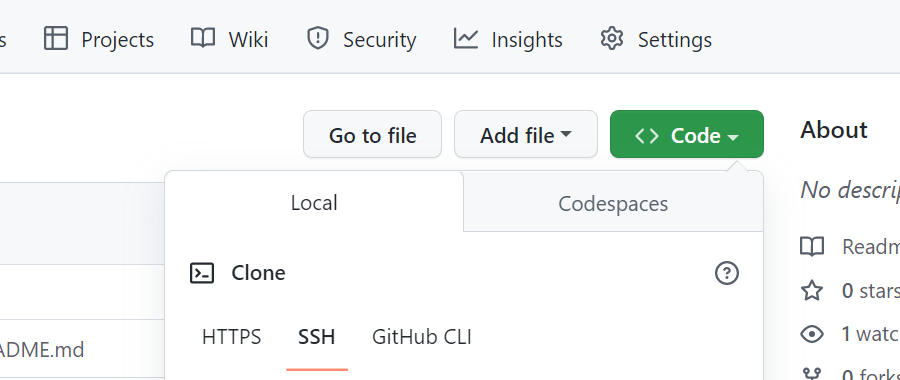
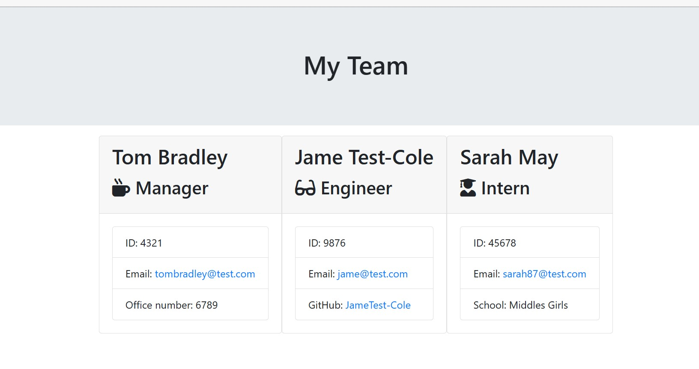

# Team-Profile-Generator
## Project Description
This is a project about generating a webpage that displays a team's basic information. The webpage is generated using the information from the user's input from  series of questions prompted from the commandline application. 
In other to build the Team, A manger details must first be added and then employees such as an Engineer or an Intern. 

Some of the input validations in place are:
- User *must* add manager details first before proceeding to other employees.
- User *must* answer all the questions.
- Employee name field cannot accept numeric values or empty.
- User *must* input a valid email in the correct format (test@test.com).
- User *must* input employee ID with a mininum of 4 digits in length.
- User *must* input 4 digits manager extention number. 

## Table of Contents

* [Installation](#Installation)
* [Usage](#Usage)
* [Demo](#Demo)
* [License](#License)
* [Tests](#Tests)
* [Packages](#Packages)
* [Contribute](#Contributors-Links)

## Installation
**How to run project on local machine**
* Install Visual Studio Code
* Download *node.js*
* Navigate to main page of the git Repository
* Click on the 'Code'
* Copy the SSH line to run on the Terminal or  the HTTPS link
* Clone the repository - 
*  Run below code to install project dependencies:
    *npm i*

## Usage
Answer the prompted questions to generate an html file sample below of the Webpage generated.

## Tests
Validation test scenarios on user inputs:
* Enter invalid email format,  it errors out for invalid email 
* Enter numeric value in the name field, it errors please enter a valid name.
* Enter  less than 4 digits in the ID field and manager extension number, it errors Please enter numbers only min of 4 digits. 
 

## Packages
- *inquirer 6.3.1*
- *validator 13.9.0*
- *jest 24.9.0*
- *email-validator 2.0.4*

## Contributors Links

[W3schools](https://www.w3schools.com/js/default.asp)

[Mdn Web Docs](https://developer.mozilla.org/en-US/docs/Web/JavaScript/Reference/Global_Objects/Array)

If you want to learn more about git clone. you can seek inspiration from the below:

[Github Docs](https://docs.github.com/en/repositories)